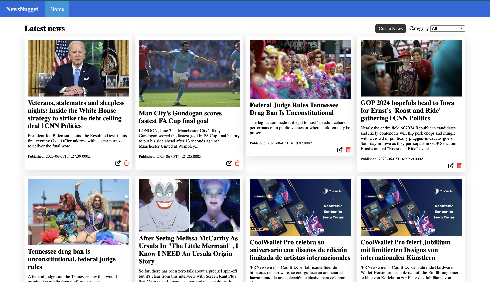
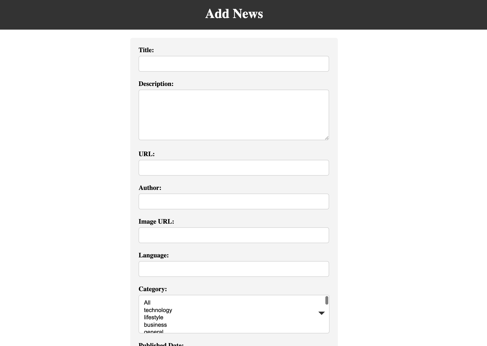
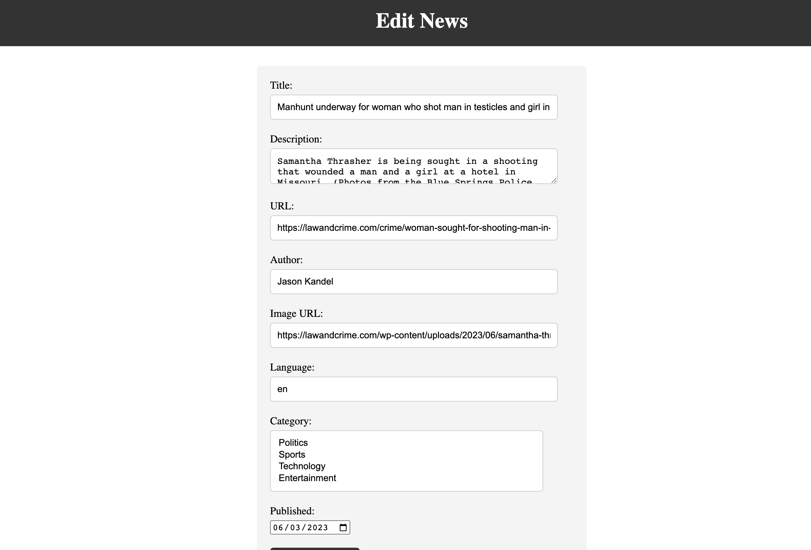

# NewsNugget

NewsNugget is a web-based application that provides a user-friendly interface to browse the latest news articles. A dynamic news aggregation platform that retrieves news data from various sources using the third-party News API. 
The goal of the NewsNugget project is to provide users with the latest news from around the world, categorized by topic. The purpose is to offer a centralized platform for news consumption.

## Overview

The NewsNugget app serves as a platform for users to manage and browse news articles from a variety of sources. The application leverages modern web technologies to offer a responsive and intuitive user interface. The application is built on a Node.js and Express.js server, with MongoDB as the database for storing user data and Mongoose for data modeling and database interactions. You can access the deployed application at [NewsNugget](https://exquisite-cranachan-1164b2.netlify.app/).

## Features

* **View Latest News**: Display latest news articles from various sources immediately upon visiting the site.
* **Filter News by Categories**: Provides a dropdown menu for users to select a category and filter the news articles accordingly.

## Getting Started

### Technologies Used

The application is developed using:

- JavaScript
- HTML
- CSS
- Fetch API

### Installation

1. Clone the repo: `git clone https://github.com/nmahmood1/NewsNugget.git`
2. Navigate to the project folder: `cd NewsNugget/client`
3. Install NPM packages: `npm install`

## Future Enhancements

* Adding user authentication and authorization for personalization.
* Implementing a search feature for finding specific news articles.
* Implementing a comment section for users to post comments and engage with the community.

## API Documentation

For details on the backend API this client interacts with, please see the [NewsNugget API](https://currentsapi.services/en/docs/).
